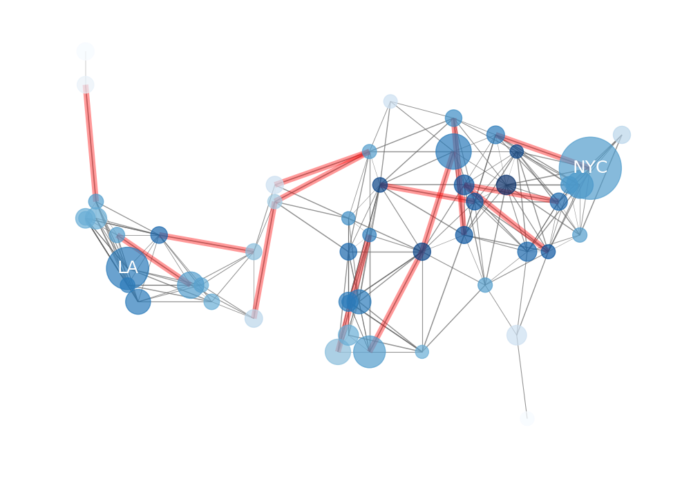
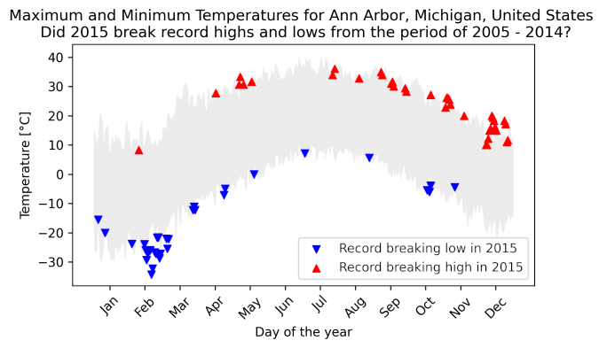
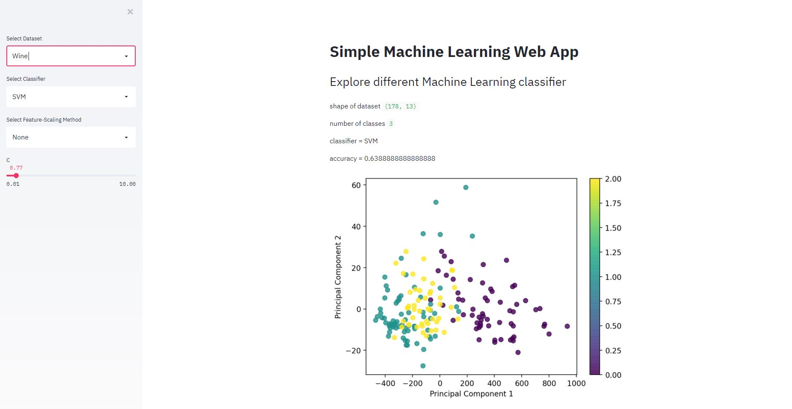
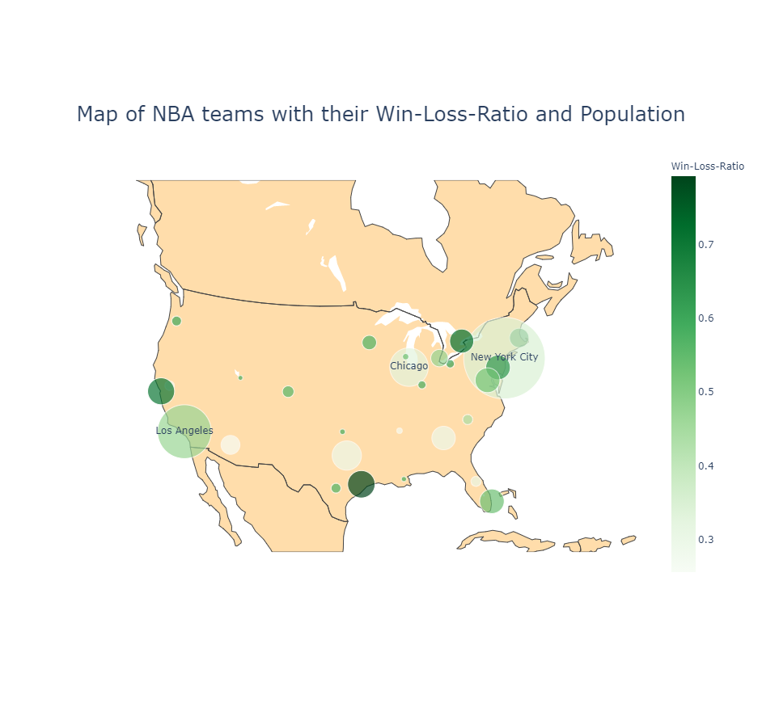

# Jan Senftleben Project Portfolio

# [Project: Analyzing a distribution network](https://github.com/janS95/analyzing_a_distribution_network)

* Read network data from a distribution network in the USA
* Node attributes: Population, Location (Latitude, Longitude)
* Edge weight: travelling cost for this connection
* Plot the graph diagram corresponding to location
* Highlight NYC and LA for better orientation
* Use population (node size) and travelling cost (edge width) for styling
* Red edges: travelling cost greater than 770 $

# [Project: Analyzing weather data](https://github.com/janS95/analyzing_weather_data)
## Was 2015 a record breaking year temperature-wise?

* Weather data from Ann Arbor, Michigan from the years 2005 - 2015
* Split data in period 2005 - 2014 and 2015
* Created diagram with maximum and minimum temperatures from 2005 - 2014 by day of the year
* Mark record breaking lows & highs in 2015

# [Project: Simple Machine Learning Web App](https://github.com/janS95/simple_ml_web_app)

* Simple Web App using streamlit and sklearn
* Select dataset (Iris, Breast Cancer, Wine), classifier (KNN, SVM, Decision Tree, Random Forest), feature scaling method, parameters of classifiers
* Used PCA for plotting the dataset
* [Try to get the best accuracy!](https://share.streamlit.io/jans95/simple_ml_web_app/main/app.py)

TODO: 
- [x] deploy to heroku/streamlit-sharing
- [ ] add more classifier
- [ ] add more parameters
        

# [Project: Major 4 US sports (NHL, MLB, NBA, NFL)](https://github.com/janS95/major_4_us_sports)
## Is there a correlation between population and success rate for sports teams?

* Read CSV data from the 4 major sports in the US and cleaned it
* Read population data from Wikipedia and cleaned it
* Mapped the sports team to metropolitan regions and latitude/longitude
* Calculated W/L-Ratios
* Calculated correlation coefficient
* Plotted scatter plot and geographical scatter plot

### Example NBA:

# [Project: Predictions on E-Mail network](https://github.com/janS95/predictions_on_email_network)

* Read E-Mail network dataset
* Node attributes: Department, Management Salary
* Generated features for predicting if employee has management salary
* Used Random Forest Classifier
* AUC-Score: 0.948
* Generated features for predicting future connections between employees
* AUC-Score: 0.901

TODO: 
- [ ] optimize features
- [ ] optimize classifier
- [ ] try other classifiers
- [ ] gridsearch
